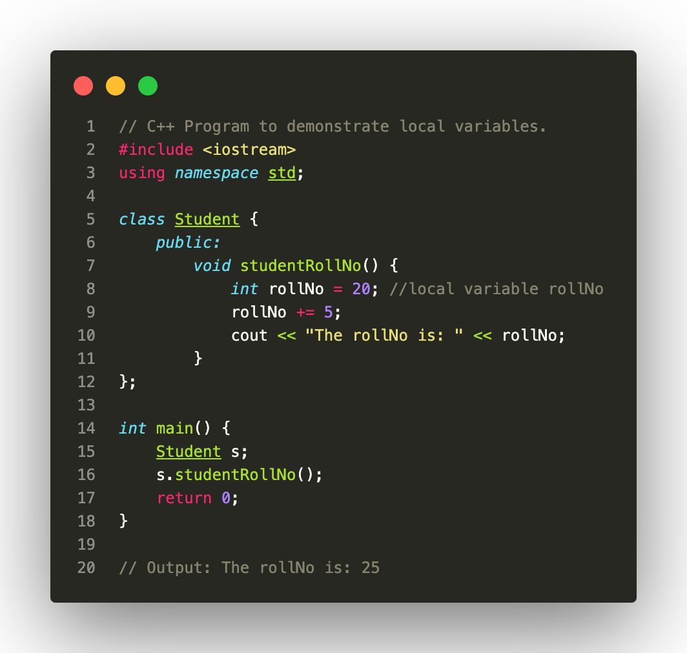
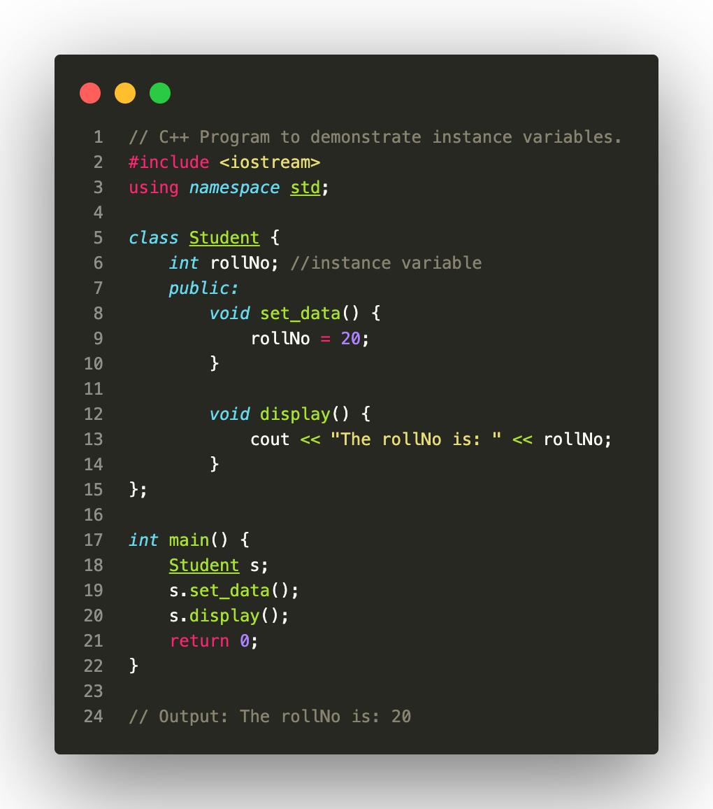

**The rules to define Variables:**

1. Variable names can be composed of alphabets, digits, and underscore.
2. Variable names must begin with either an alphabet or an underscore.
3. Whitespace and special characters are not allowed within a variable name.
4. Reserved keywords cannot be used as variable names.
5. Variable names are case-sensitive.

   **Note: It should not start with a digit.**

**Types of variables**

* **Local Variables:** Local variables are declared inside the function, method, or block. Their scope lies within the block where they are declared, that is we can access these variables only inside the block. It is mandatory to initialize them otherwise the compiler does it itself and gives it a garbage value.

  
* **Instance Variables**: Instance variables are declared in a class but outside the functions, methods, and other blocks. These variables get memory when an object of that class is created and are destroyed when the object gets destroyed. It is not mandatory to initialize them. Access specifiers can also be used but if we don’t specify them then the default is private.

  
